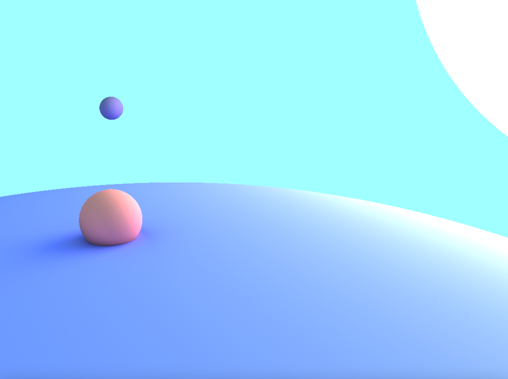
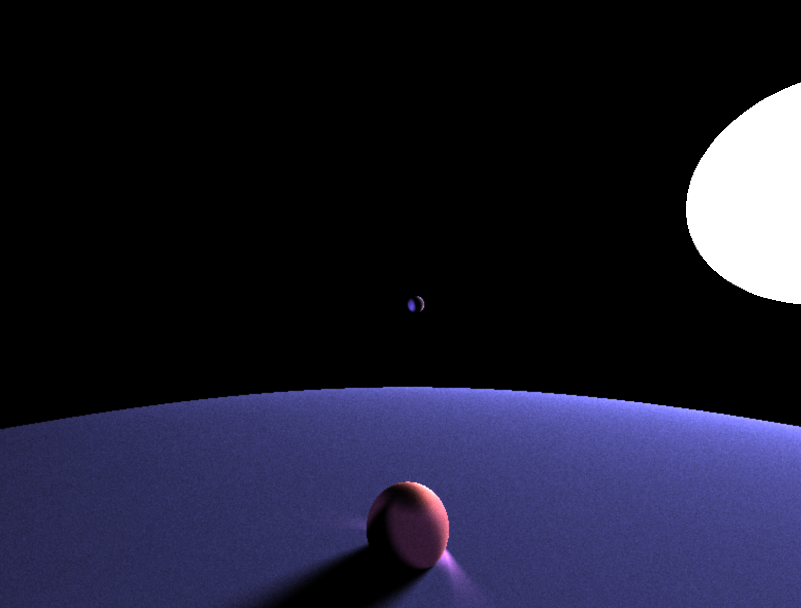

# Ray Tracing
## In the GPU (OpenGL Fragment Shader)

# Examples
Note that the following examples were captured at different number of iterations therefore some might look smoother and cleaner than others.

