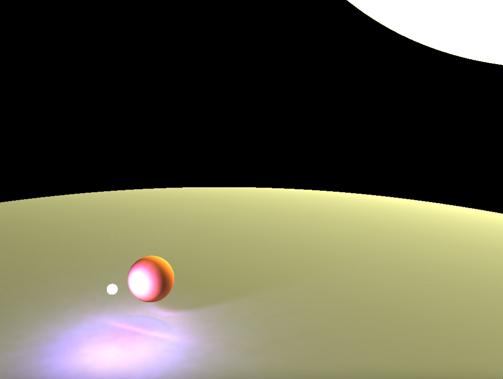

# Ray Tracing
## In the GPU (OpenGL Fragment Shader)

# Todo
- Store objects in texture (objects should be defined on CPU)
- BRDF and material properties
- Apply OIDN for denoising
- bloom effect

# Examples

The following examples uses PBR

The following examples are before I implemented PBR

